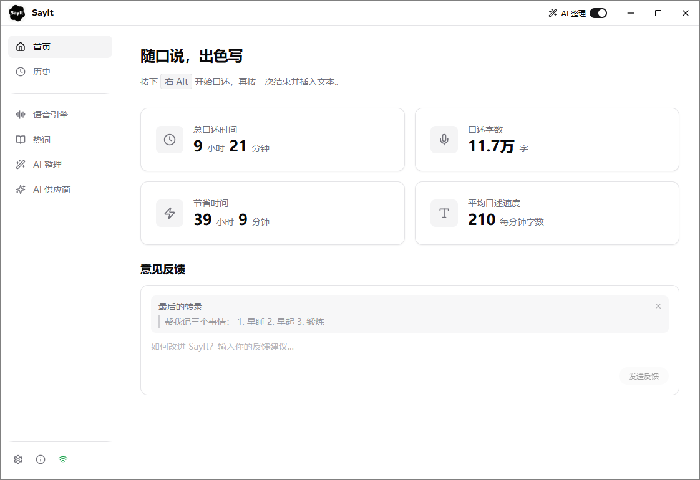
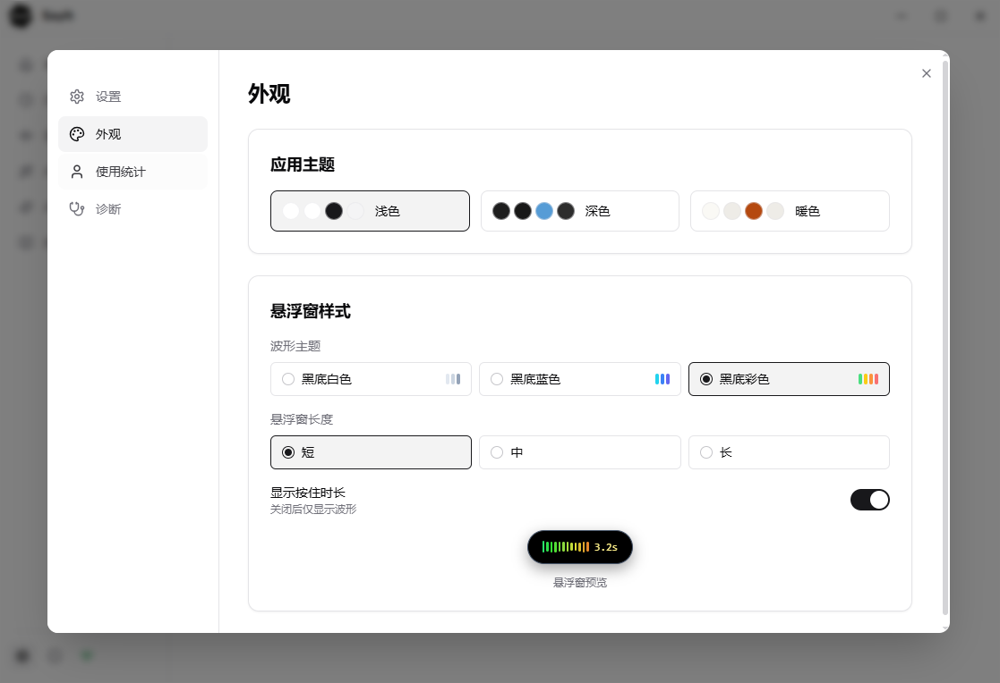
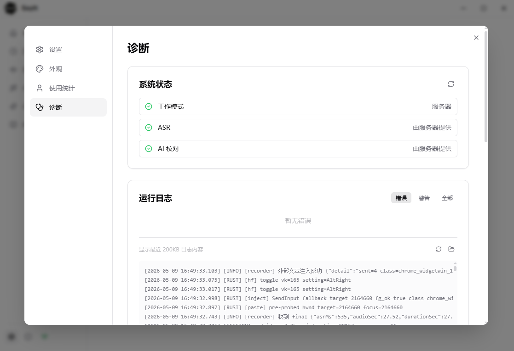

<div align="center">


# SayIt

**随口说，出色写 — 用说话代替打字，AI 实时把口语变成书面表达。**

按下快捷键开始说话，再按一次，润色后的文字自动输入到光标位置。

[](./LICENSE)
[](https://github.com/crosswk/SayIt/releases)

**[下载客户端](https://github.com/crosswk/SayIt/releases/latest)** · **[网页版体验](https://sayitapp.site)** · **[配置文档](docs/)**

</div>

---

<div align="center">



*主界面 — 统计数据与快捷操作*

<br>



*外观配置 — 多主题切换与悬浮窗自定义*

<br>



*诊断面板 — 实时运行状态与连接检测*

</div>

---

## 为什么做 SayIt

在 AI 时代，模型的输出 Token 速度越来越快，人却受限于打字速度。特别是和 AI 对话时，说话是非常自然和高效的方式。

最开始用的是 Typeless，体验确实很好，Typeless 也开启了全民 VibeCoding 语音输入法的时代。但用了一段时间发现：价格太贵，AI 润色的 Prompt 不能自定义，有时候并不想要那么格式化的整理。

这是一个开源项目，做这个纯粹是对语音输入的需求很强，而且现在 AI 极大地放大了个人的能力。

## 下载使用

**大部分用户直接下载客户端即可，无需任何配置。**

[下载 Windows 安装包](https://github.com/crosswk/SayIt/releases/latest)

安装后默认连接公共服务器，开箱即用。也可以先通过 [网页版 Demo](https://sayitapp.site) 快速体验。

## 使用模式

| 模式 | 适合谁 | 需要什么 |
|------|--------|---------|
| **服务器模式**（默认） | 快速体验 | 无需配置，连接公共服务器 |
| **云 API 模式** | 个人用户长期使用 | 自己的 ASR + AI API Key |
| **自部署服务器** | 团队 / 企业内部 | 一台带 GPU 的服务器 |

### 服务器模式（默认）

下载即用。客户端默认连接公共体验服务器。

### 云 API 模式（推荐个人用户）

不需要服务器，客户端直接调用云端服务。

- **语音识别**：推荐豆包 ASR 或千问 ASR
- **AI 润色**：推荐 DeepSeek，速度快价格便宜

详见配置文档：
- [语音识别配置](docs/SayIt%20语音识别配置.md)
- [AI 润色供应商配置](docs/SayIt%20AI%20润色供应商配置.md)

### 自部署服务器（团队 / 企业）

适合对数据隐私有要求、或需要内网部署的场景。

```bash
git clone https://github.com/crosswk/SayIt.git
cd SayIt/server
cp config.example.yaml config.yaml
cp .env.example .env
# 编辑 .env 填入配置

# Docker 部署
docker compose up -d --build
```

需要 NVIDIA GPU（≥16GB 显存）。

## 功能特性

- **全局语音输入** — 在任何应用中按下快捷键即可口述，文字自动插入光标位置
- **AI 智能润色** — 口语自动转书面语，去口癖、纠错、分段，Prompt 完全可自定义
- **多种语音识别** — 豆包 ASR，千问 ASR、本地离线识别
- **热词增强** — 自定义专业术语词表，提升识别准确率
- **悬浮窗反馈** — 录音状态、波形动画、处理进度实时可见
- **历史记录** — 所有转录结果本地保存，支持搜索和收藏
- **隐私可控** — 支持完全自部署，数据流向透明

## 项目结构

```
SayIt/
├── client/                   # 桌面客户端（Tauri + React + Rust）
│   ├── src/
│   │   ├── components/       # 通用 UI 组件
│   │   ├── features/        # 功能模块（设置、自动更新）
│   │   ├── overlay/         # 悬浮窗
│   │   ├── pages/           # 页面
│   │   ├── services/        # 核心服务
│   │   └── themes/          # 主题
│   └── src-tauri/           # Rust 后端
├── server/                  # 后端服务（FastAPI）
│   ├── backend/app/         # FastAPI 应用
│   ├── gateway/             # HTTPS 反向代理
│   └── web/                 # 网页版
├── docs/                    # 用户文档
└── rag-main/               # RAG 知识库（可选）
```

## 技术栈

| 层 | 技术 |
|----|------|
| 桌面客户端 | Tauri v2、React、TypeScript、Tailwind CSS |
| 客户端系统集成 | Rust（全局键盘钩子、剪贴板、SQLite） |
| 后端服务 | Python、FastAPI、WebSocket |
| 语音识别 | Qwen3-ASR、字节豆包 ASR、FunASR |
| AI 润色 | DeepSeek、通义千问、Azure OpenAI、Ollama |
| 部署 | Docker Compose |

## 开发

### 客户端

```bash
cd client
npm install
npm run tauri dev
```

前置要求：Node.js 18+、Rust 1.75+

### 服务端

```bash
cd server
python3 -m venv .venv && source .venv/bin/activate
pip install -r backend/requirements.txt
cd backend && uvicorn app.main:app --port 8000
```

前置要求：Python 3.10+、NVIDIA GPU + CUDA

## 交流反馈

有任何问题、建议或想法，欢迎提交 GitHub Issue 或加入用户反馈群。

## 贡献

欢迎提交 Bug 报告和功能建议！请阅读 [CONTRIBUTING.md](./CONTRIBUTING.md)。

## 许可证

[GNU Affero General Public License v3.0](./LICENSE)

你可以自由使用、修改和自部署 SayIt。如果你分发修改版本或将其作为网络服务运行，需要以相同许可证公开源代码。
